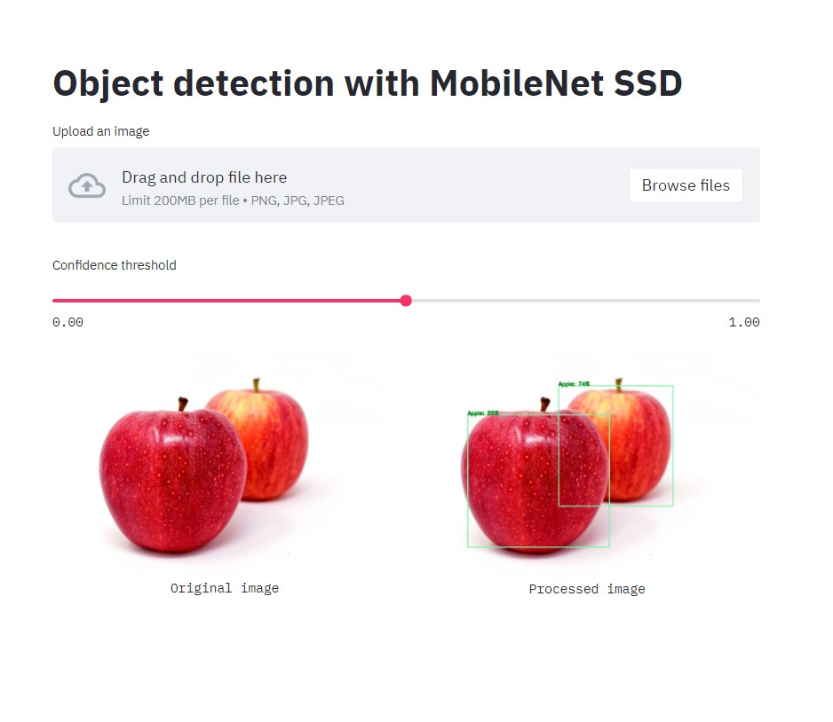

# TDCX - Assignment

#### Problem Statement - Create an object detection model and use it for prediction.

[](https://www.python.org/downloads/release/python-360/)
[](https://github.com/tensorflow/tensorflow/releases/tag/v2.3.0)

## Introduction

Tensorflow currently updated its [Object Detection API](https://github.com/tensorflow/models/tree/master/research/object_detection) which is now compatible with Tensorflow 2,
I tried to train the a model published in the [TF2 model zoo](https://github.com/tensorflow/models/blob/master/research/object_detection/g3doc/tf2_detection_zoo.md), and train them with custom data provided in mail.

This project have two parts
1. UI Part
2. Model training


## 1. Running the trained model

I have created a simple Streamlit powered app UI with Docker.
Why Streamlit? 
[Streamlit](https://docs.streamlit.io/en/stable/) is an open-source Python library that makes it easy to create and share beautiful, custom web apps for machine learning and data science.

Why Docker? 
An end-to-end platform container means you have an IDE or Jupyter Notebook / Lab, and your entire working environment, running in the container and also run the code inside it.This provides you **Reproducibility** and **Portability**.

Steps to start the app:
```bash

git clone https://gitlab.com/maheshwariumang/tdc-assignment.git
cd tdc-assignment\streamlit_ui
docker build -t object_detection_app .
docker run -p 8501:8501 object_detection_app:latest

``` 
Then visit localhost:8501

Sample image for Streamlit App running at your 



## 2. Using Tensorflow Object Detection API

Why Tensorflow Object detection API?
The [TensorFlow Object Detection API][tensorflowodapi] is an open source framework built on top of TensorFlow that makes it easy to construct, train and deploy object detection models.

How to use these pre-trained models?
Let's start installation of [TensorFlow Object Detection API][tensorflowodapi] and train custom detector model.
1. We will use [Anaconda](https://www.anaconda.com/products/individual) and create new [environment](https://docs.conda.io/projects/conda/en/latest/user-guide/tasks/manage-environments.html)for installing the packages.
```bash
# create new environment
conda create --name object_detection_env python=3.6

# activate your environment before installation or running your scripts 
conda activate object_detection_env
``` 
2. Installing the Tensorflow and its dependencies
```bash
# Installing tensorflow
conda install tensorflow==2.3.0 tensorflow-gpu==2.3.0

# installing cudatoolkit and cudnn
conda install cudatoolkit==10.1.243=h74a9793_0 
conda install cudnn==7.6.5=cuda10.1_0
``` 
3. Installing the Object Detection API framework
Clone the tensorflow models repository:
```bash
git clone https://github.com/tensorflow/models.git
```

Make sure you have [protobuf compiler](https://grpc.io/docs/protoc-installation/#install-using-a-package-manager) version >= 3.0, by typing `protoc --version`, or install it on Ubuntu by typing `apt install protobuf-compiler`.

Then proceed to the python package installation as follows:

```bash
# remember to activate your python environment first
cd models/research
# compile protos:
protoc object_detection/protos/*.proto --python_out=.
# Install TensorFlow Object Detection API as a python package:
cp object_detection/packages/tf2/setup.py .
python -m pip install .
```
This will install object detection api as python package that will be available in your environment.
4. Testing the installation
```bash
# Test the installation.
python object_detection/builders/model_builder_tf2_test.py
```

For more installation options, please refer to the original [installation guide](https://github.com/tensorflow/models/blob/master/research/object_detection/g3doc/tf2.md).

You will need some additional dependencies:

```bash
# install OpenCV python package
pip install opencv-python
pip install opencv-contrib-python
```
5. Preparing your custom dataset for training
6. Downloading the pre-trained model weights
7. Configuring the pipeline configurations
8. Training the model
9. Check the training progress
10. Exporting the trained model

# Credits:
- [Tensorflow][tensorflowodapi] team 
- TDCX for providing training and testing data

   [tensorflowodapi]: <https://github.com/tensorflow/models/tree/master/research/object_detection#tensorflow-object-detection-apir>
